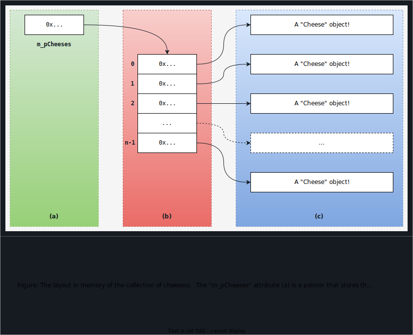

# Workshop 4: Containers

In this workshop, you will code three classes that are in composition and aggregation relations. 


## Learning Outcomes

Upon successful completion of this workshop, you will have demonstrated the abilities to:

- design and code composition and aggregation class relationships
- use member functions of the string class to parse a string into tokens based on simple rules
- design and code a class that manages a dynamically allocated array of pointers to objects (double pointers)


## Submission Policy

The workshop is divided into two coding parts and one non-coding part:

- *Part 1*: worth 0% of the workshop's total mark, is optional and designed to assist you in completing the second part.
- *Part 2*: worth 100% of the workshop's total mark, is due on **Sunday at 23:59:59** of the week of your scheduled lab.  Submissions of *Part 2* that do not contain the *reflection* are not considered valid submissions and are ignored.
- *reflection*: non-coding part, to be submitted together with *Part 2*. The reflection does not have marks associated to it but can incur a **penalty of max 40% of the whole workshop's mark** if your professor deems it insufficient (you make your marks from the code, but you can lose some on the reflection).

The workshop should contain ***only work done by you this term*** or provided by your professor.  Work done in another term (by you or somebody else), or work done by somebody else and not **clearly identified/cited** is considered plagiarism, in violation of the Academic Integrity Policy.

Every file that you submit must contain (as a comment) at the top **your name**, **your Seneca email**, **Seneca Student ID** and the **date** when you completed the work.

- If the file contains only your work, or work provided to you by your professor, add the following message as a comment at the top of the file:

    > I have done all the coding by myself and only copied the code that my professor provided to complete my workshops and assignments.

- If the file contains work that is not yours (you found it online or somebody provided it to you), **write exactly which parts of the assignment are given to you as help, who gave it to you, or which source you received it from.**  By doing this you will only lose the mark for the parts you got help for, and the person helping you will be clear of any wrong doing.


## Compiling and Testing Your Program

All your code should be compiled using this command on `matrix`:

```bash
/usr/local/gcc/10.2.0/bin/g++ -Wall -std=c++17 -g -o ws file1.cpp file2.cpp ...
```

- `-Wall`: compiler will report all warnings
- `-std=c++17`: the code will be compiled using the C++17 standard
- `-g`: the executable file will contain debugging symbols, allowing *valgrind* to create better reports
- `-o ws`: the compiled application will be named `ws`

After compiling and testing your code, run your program as following to check for possible memory leaks (assuming your executable name is `ws`):

```bash
valgrind --show-error-list=yes --leak-check=full --show-leak-kinds=all --track-origins=yes ws
```

- `--show-error-list=yes`: show the list of detected errors
- `--leak-check=full`: check for all types of memory problems
- `--show-leak-kinds=all`: show all types of memory leaks identified (enabled by the previous flag)
- `--track-origins=yes`: tracks the origin of uninitialized values (`g++` must use `-g` flag for compilation, so the information displayed here is meaningful).

To check the output, use a program that can compare text files.  Search online for such a program for your platform, or use *diff* available on `matrix`.


## Part 1 (0%)

The first portion of this workshop consists of these modules:
- `w4` (supplied)
- `Cheese`

Enclose all your source code within the `sdds` namespace and include the necessary guards in each header file.


### `w4` Module (supplied)


**Do not modify this module!**  Look at the code and make sure you understand it.


### `Cheese` Module

This module includes the definition of a class that represents a block or roll of cheese that can be sliced into smaller portions.

Design and code a class named `Cheese` that can store the following information (for each attribute, choose any type that you think is appropriate--you must be able to justify the decisions you make):

- **the name** (a string): the name of the cheese, defaults to `NaC` - "Not a Cheese"
- **the weight** (an integer): the weight/amount in grams of the cheese
- **the price** (a floating-point number in double precision): the price per gram of the cheese
- **the features** (a string): a description of the features/qualities of the cheese


***Public Members***

- a default constructor

- `Cheese(const std::string& str)`: A constructor that receives the cheese's details as a string; this constructor is responsible for extracting information about the cheese from the string and storing the tokens in the instance's attributes. The string will always have the following format:
  ```
  Name,Weight,Price,Features
  ```

  Every token that follows the price is a feature of the cheese (e.g., for `"Cheddar, 1200, 2.99, Hard, Sharp, Smooth"` the features are *Hard*, *Sharp*, and *Smooth*). Each of extracted tokens should be stored in the respective data member; the features should be stored as a space separated list of strings (e.g., `"Hard Sharp Smooth"`).

  This constructor should remove all leading and trailing spaces from the **beginning and end** of any token extracted from parameter.

  When implementing the constructor, consider these following functions:
  - [std::string::substr()](https://en.cppreference.com/w/cpp/string/basic_string/substr)
  - [std::string::find()](https://en.cppreference.com/w/cpp/string/basic_string/find)
  - [std::string::find_first_of()](https://en.cppreference.com/w/cpp/string/basic_string/find_first_of)
  - [std::string::erase()](https://en.cppreference.com/w/cpp/string/basic_string/erase)
  - [std::stoul()](https://en.cppreference.com/w/cpp/string/basic_string/stoul)
  - [std::stod()](https://en.cppreference.com/w/cpp/string/basic_string/stod)

- `Cheese slice(size_t weight)`: a modifier that receives as a parameter a weight/amount of cheese to slice from the current cheese object.

  If there is enough cheese to make this slice (weight <= weight of the cheese in current object), then return a copy of current cheese with the desired weight. Update the current object's weight after slicing.

  If there isn't enough cheese, then return a cheese object that is in an empty state instead.

- A set of queries to retrieve the value of each attribute of the cheese.


***Free Helper***

- overload the insertion operator to insert the contents of a Cheese object into an `ostream` object in the following format:
  - A vertical bar "|"
  - The name of the cheese in *left alignment* and a *field width of 21*
  - A vertical bar "|"
  - The weight of the cheese with a *field width of 5*
  - A vertical bar "|"
  - The price of the cheese in *fixed format, 2 decimal place precision and a field width of 5*
  - A vertical bar "|"
  - The features of the cheese in *right alignment* and a *field width of 34*
  - A vertical bar "|"
  - A newline
- Look in the sample output file for hints about formatting

Add any **private** members that your design requires (without changing the specs above)!


### Sample Output

When the program is started with the command (the file `cheeses.txt` is provided):
```
ws cheeses.txt
```
the output should look like the one from the `sample_output.txt` file.


### Test Your Code

To test the execution of your program, use the same data as shown in the output example above.

Upload your source code to your `matrix` account. Compile and run your code using the latest version of the `g++` compiler (available at `/usr/local/gcc/10.2.0/bin/g++`) and make sure that everything works properly.

Then, run the following command from your account (replace `profname.proflastname` with your professor’s Seneca userid):
```
~profname.proflastname/submit 345_w4_p1
```
and follow the instructions.

***This part represents a milestone in completing the workshop and is not marked!***


## Part 2 (100%)

The second part of this workshop upgrades your solution to include two more modules:
- `CheeseShop`
- `CheeseParty`

The module `Cheese` remains the same as in part 1.


### `w4` Module (supplied)

The w4 module is updated for part 2.

**Do not modify this module!**  Look at the code and make sure you understand it.


### `CheeseShop` Module

Add a `CheeseShop` module to your project that defines a class named `CheeseShop`. This class represents a shop that sells cheese.

This class should have attributes to store the name of the shop and manage a **dynamically-allocated array of pointers** to **dynamically-allocated objects** of type `Cheese`: `const sdds::Cheese**` (each element of the array points to an object of type `Cheese`). ***Very Important***: This class is responsible for managing both the array and the `Cheese` objects.


***Public Members***

- `CheeseShop(const std::string& name)`:  a constructor that receives as a parameter the name of the shop. The default value for the parameter is `"No Name"`.

- `CheeseShop& addCheese(const Cheese&)`: a modifier that adds a cheese object to the array of pointers.

  In order to add another cheese, this class should resize the array of pointers using DMA (dynamic memory allocation).  The `CheeseShop` will be adding/storing copies of the `Cheese` passed through the parameter.

  **HINT**: It may be helpful to review the `w4_p1/p2.cpp` files as they have examples on how to work with a dynamic array of `Cheese` pointers (i.e., a double pointer).

  If you need a refresher on arrays of pointers, re-read the material from the last term (chapter *Abstract Base Classes*, section *Array of Pointers*).

- add any other **special members** that are necessary to manage the resources.


***Friend Helpers***

- overload the insertion operator to insert the content of a `CheeseShop` object into an `ostream` object.
  - if the shop is out of cheese:
  ```
  --------------------------
  SHOP_NAME 
  --------------------------
  This shop is out of cheese!
  --------------------------
  ```
  - if the shop has some cheese:
  ```
  --------------------------
  SHOP_NAME 
  --------------------------
  CHEESE1 DETAILS
  CHEESE2 DETAILS
  ...
  --------------------------
  ```

Add any **private** members that your design requires (without changing the specs above)!


### `CheeseParty` Module

Add a `CheeseParty` module to your project. This module represents a communal pool of cheese for tasting and sharing.

This class should have attributes to store and manage a **dynamically-allocated array of pointers** to objects of type `Cheese`: `const sdds::Cheese**` (each element of the array points to an object of type `Cheese`). ***Very Important***: This class is responsible for managing the array of pointers but is not managing the life of `Cheese` objects.




***Public Members***

- a default constructor.

- `CheeseParty& addCheese(const Cheese&)`: a modifier that adds a cheese object to the array of pointers.
  - search in the array of already stored cheeses to find if the parameter is already in there (compare the address of the parameter with the addresses stored in the array).
  - if the parameter is already in the array, this function does nothing.
  - if the parameter is not in the array, this function resizes the array to make room for the parameter (if necessary) and stores the **address** of the parameter in the array (your function should not make a copy of the parameter).
  - return current instance.

- `CheeseParty& removeCheese()`: a modifier that removes any cheeses from the array that have a 0 weight.
  - searches the array for 0 weight cheeses and sets the pointer in the array to `nullptr` if such a `cheese` is found.

  **To challenge yourself, try to actually resize the array.**

- add any other **special members** that are necessary to manage the resource.


***Friend Helpers***

- overload the insertion operator to insert the content of a `CheeseParty` object into an **ostream** object:
  - if there is no cheese at the party:
  ```cpp
  --------------------------
  Cheese Party
  --------------------------
  This party is just getting started!
  --------------------------
  ```
  - if the party has cheese, print out each cheese pointed to by the pointers in the array where it isn't nullptr
  ```cpp
  --------------------------
  Cheese Party
  --------------------------
  CHEESE1 DETAILS
  CHEESE2 DETAILS
  ...
  --------------------------
  ```

Add any **private** members that your design requires (without changing the specs above)!


### Sample Output

When the program is started with the command (the file `cheeses.txt` is provided):
```
ws cheeses.txt
```
the output should look like the one from the `sample_output.txt` file.


### Reflection

Study your final solution, reread the related parts of the course notes, and make sure that you have understood the concepts covered by this workshop. **This should take no less than 30 minutes of your time and the result is suggested to be at least 150 words in length.**

Create a **text** file named `reflect.txt` that contains your detailed description of the topics that you have learned in completing this particular workshop and mention any issues that caused you difficulty and how you solved them. Include in your explanation—**but do not limit it to**—the following points:

- the difference between the implementations of a composition and an aggregation with reference to the classes used in this workshop. Note that both classes `CheeseShop` and `CheeseParty` have an attribute of type `const Cheese**` and yet they are in different relationships with class `Cheese`.  *Discuss!*
- the difference between the implementations of move and copy functions in a composition and an aggregation with reference to the classes used in this workshop.
- both `CheeseShop` and `CheeseParty` classes have an `addCheese` function, how do they differ in implementation. Why?
- the `CheeseShop` class doesn't have a `removeCheese` function like the `CheeseParty` does. How would you implement one to keep in line with how `CheeseShop` handles its cheeses? What else would need to change in the project? Use pseudocode to illustrate your idea.

To avoid deductions, refer to code in your solution as examples to support your explanations.


### Submission

To test and demonstrate execution of your program use the same data as shown in the output example above.

Upload the source code and the reflection file to your `matrix` account. Compile and run your code using the latest version of the `g++` compiler (available at `/usr/local/gcc/10.2.0/bin/g++`) and make sure that everything works properly.

Then, run the following command from your account (replace `profname.proflastname` with your professor’s Seneca userid):
```
~profname.proflastname/submit 345_w4_p2
```
and follow the instructions.

**:warning:Important:** Please note that a successful submission does not guarantee full credit for this workshop. If the professor is not satisfied with your implementation, your professor may ask you to resubmit. Resubmissions will attract a penalty.
